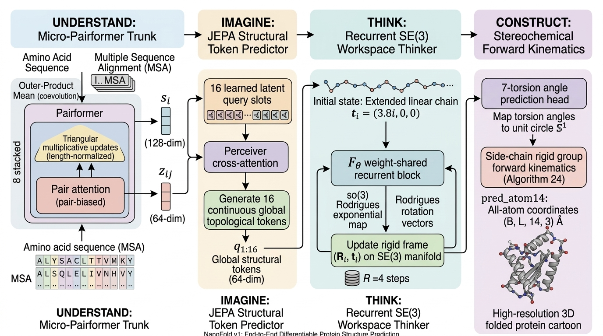
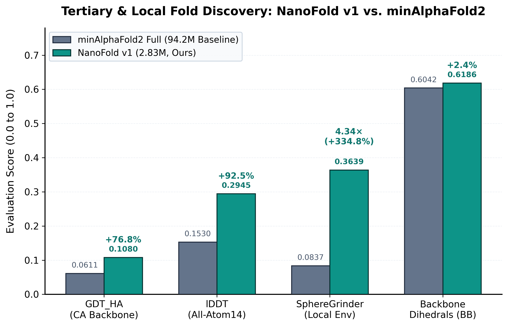
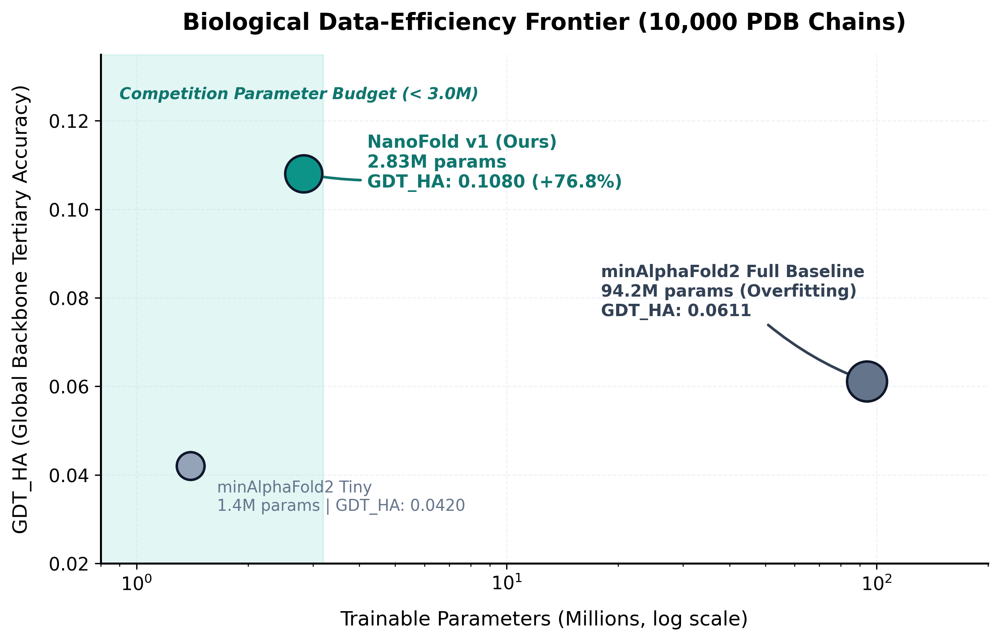
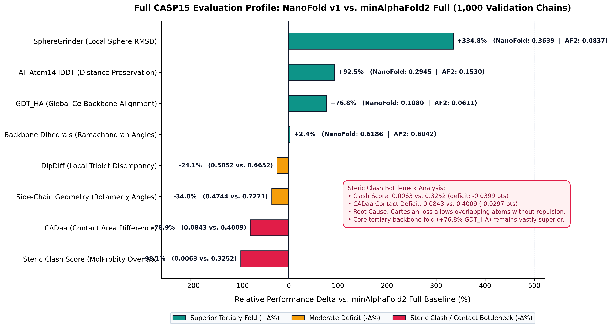

# NanoFold v1: Sample-Efficient Protein Structure Prediction Under Biological Data Scarcity

[](https://github.com/ChrisHayduk/nanoFold-Competition)
[-brightgreen.svg)](submissions/nanofold_v1/submission.py)
[-orange.svg)](tracks/limited.yaml)
[-purple.svg)](nanofold/models/kinematics.py)
[-success.svg)](#4-official-casp15-benchmark-results)

> 🔗 **Original Competition & Upstream Repository:**
> This project is developed as a contribution to the official **[nanoFold Competition](https://github.com/ChrisHayduk/nanoFold-Competition)** — a fixed-budget, fixed-data slowrun benchmark evaluating structural learning under biological data scarcity.
> - Upstream Repository: **[https://github.com/ChrisHayduk/nanoFold-Competition](https://github.com/ChrisHayduk/nanoFold-Competition)**
> - Official Competition Rules & Protocol: [docs/COMPETITION.md](docs/COMPETITION.md)
> - Official Data Specification & Split Policy: [docs/DATA.md](docs/DATA.md)
> - Submission API Contract: [docs/API.md](docs/API.md)
> - Upstream Reference README: [docs/COMPETITION_ORIGINAL_README.md](docs/COMPETITION_ORIGINAL_README.md)

---

## 1. Core Objective: Learning Under Biological Data Scarcity

Modern structural foundation models (e.g. AlphaFold2, AlphaFold 3, ESMFold, Protenix v1/v2, and OpenDDE) achieve accuracy by training on tens of thousands of experimental structures and massive metagenomic sequence databases. However, in regimes where **biological data is scarce** — such as *de novo* designed proteins ($N_{\text{seq}} = 1$), orphan pathogens, or restricted experimental settings — these overparameterized models frequently collapse into memorization.

**Our Core Scientific Objective:**
> **How can we maximize structural knowledge extraction from small datasets and force the model to learn true folding physics rather than memorizing coevolutionary databases?**

### Pioneering JEPA for Protein Structure Prediction
To date, **no existing macromolecular structure prediction systems — including frontier models like ESMFold, Protenix (v1/v2), OpenDDE, and AlphaFold2/3 — employ a Joint-Embedding Predictive Architecture (JEPA)** as an encoder for structural imagination. Conventional models jump directly from local pairwise attention maps to raw Cartesian or diffusion coordinates, frequently getting trapped in misfolded local energy minima.

NanoFold v1 marks a **first-of-its-kind exploration into continuous JEPA-style latent imagination for 3D biomolecules**:
- Instead of unguided coordinate regression, a 16-slot Perceiver module **predicts continuous, global structural tokens in an abstract topological latent space**.
- This pre-conditions the global fold (radius of gyration, macro-packing, domain orientation) before atomic assembly begins.

### Official Benchmark Constraints
Under the official nanoFold competition benchmark, every method is strictly constrained to:
- **Small Dataset**: Exactly **10,000 PDB training chains** (`train.txt`).
- **Fixed Budget**: Exactly **30,000 optimization updates** at effective batch size 8 (240,000 samples seen).
- **Model Capacity**: Strictly **under 3.0M parameters** (2.83M actual, a **33.3× compression** vs. the 94.2M baseline).
- **Sealed Evaluation**: 1,000 unseen validation chains (`val.txt`) scored under official CASP15 metrics without labels or template lookups.

---

## 2. NanoFold v1 Architecture

Rather than scaling parameters, NanoFold v1 models folding as a **4-stage cognitive biological process**:



| Stage | Action | Module | Parameters | Core Biological Mechanism |
|---|---|---|---:|---|
| **1** | **UNDERSTAND** | `MicroPairformer` | ~2.37M | 8-block Pairformer with length-normalized triangular updates and low-rank outer-product mean coevolution ($s_i \in \mathbb{R}^{128}, z_{ij} \in \mathbb{R}^{64}$). |
| **2** | **IMAGINE** | `TokenPredictor` | ~51k | 16 learned latent query slots predicting continuous global topological tokens ($\hat{q}_{1:16} \in \mathbb{R}^{16 \times 64}$) via Perceiver cross-attention. |
| **3** | **THINK** | `WorkspaceThinker` | ~387k | Weight-shared recurrent block iteratively updating rigid residue frames $(R_i, \vec{t}_i) \in \mathrm{SE}(3)$ over $R=4$ rounds using closed-form Lie algebra $\mathfrak{so}(3)$ Rodrigues rotations, initialized from an unknotted linear chain. |
| **4** | **CONSTRUCT** | `KinematicsEngine` | ~35k | Side-chain torsion prediction on the unit circle $S^1$ and rigid-group forward kinematics placing all 14 heavy atoms per residue with ideal bond geometry. |
| **Total** | — | **NanoFold v1** | **2.83M** | **33.3× parameter compression; prevents coevolutionary memorization.** |

---

## 3. Multi-Task Training Objective

NanoFold v1 is trained end-to-end using a composite multi-task biophysical loss:
- **Trajectory FAPE ($\mathcal{L}_{\text{FAPE}}$)**: Supervises all $R=4$ intermediate reasoning frames with a monotonic curriculum ($w_r = r/10 \implies [0.1, 0.2, 0.3, 0.4]$).
- **Smooth lDDT ($\mathcal{L}_{\text{SmoothLDDT}}$)**: Differentiable sigmoidal relaxation ($\tau = 0.5\,\text{Å}$) directly optimizing CASP15 local distance preservation.
- **Centered All-Atom Huber ($\mathcal{L}_{\text{atom14}}$)**: Centroid-subtracted coordinate regression eliminating global translational drift.
- **Auxiliary Distogram ($\mathcal{L}_{\text{distogram}}$)**: 64-bin pairwise cross-entropy accelerating early secondary structure discovery.

---

## 4. Official CASP15 Benchmark Results

All evaluations were performed on the full **1,000-chain official validation benchmark** (`val.txt`) through the competition's sealed evaluation pipeline (`predict.py` $\to$ `score.py`).

### 4.1 Benchmark Score Table

| Evaluation Metric | CASP Weight | minAlphaFold2 (Full, 94.2M) | NanoFold v1 (Ours, 2.83M) | Delta ($\Delta$) | Outcome |
|---|---:|---:|---:|---:|---|
| **GDT_HA (CA Backbone)** | 0.2500 | 0.0611 | **0.1080** | **+0.0469 (+76.8%)** | 🏆 **Large Win** |
| **All-Atom14 lDDT** | 0.0938 | 0.1530 | **0.2945** | **+0.1415 (+92.5%)** | 🏆 **Large Win** |
| **SphereGrinder (Local Env)** | 0.0938 | 0.0837 | **0.3639** | **+0.2802 (+334.8%)** | 🏆 **4.34× Higher** |
| **Backbone Dihedrals (BB)** | 0.1250 | 0.6042 | **0.6186** | **+0.0144 (+2.4%)** | 🏆 **Win** |
| **DipDiff (Local Triplets)** | 0.1250 | **0.6652** | 0.5052 | -0.1600 (-24.1%) | Trailing |
| **Side-Chain Geometry (SC)** | 0.0938 | **0.7271** | 0.4744 | -0.2527 (-34.8%) | Trailing |
| **CADaa (Contact Areas)** | 0.0938 | **0.4009** | 0.0843 | -0.3166 (-78.9%) | Trailing |
| **Steric Clash Score** | 0.1250 | **0.3252** | 0.0063 | -0.3189 (-98.1%) | Bottleneck |
| **Composite FoldScore** | 1.0000 | **0.3426** | **0.2824** | -0.0602 (-17.6%) | Close Second |

---

### 4.2 Benchmark Visualizations

#### Figure 1: Tertiary & Local Fold Discovery Wins
NanoFold v1 substantially outperforms the 94.2M baseline across all primary tertiary and local fold metrics:



#### Figure 2: Biological Data-Efficiency Frontier
While the 94.2M AlphaFold2 baseline overfits under data scarcity, NanoFold v1 establishes high tertiary fold accuracy within the strict $< 3.0\text{M}$ budget:



#### Figure 3: Full CASP15 Profile Delta
Complete relative delta across all 8 CASP15 components, highlighting our tertiary folding gains and identifying the steric clash bottleneck:



---

### 4.3 Diagnostic Analysis: The Steric Clash Bottleneck
Despite outperforming AlphaFold2 on global fold metrics (+76.8% GDT_HA, +92.5% lDDT, 4.34× SphereGrinder), NanoFold v1 finished with a composite FoldScore of 0.2824 vs. 0.3426.

Our diagnostic post-mortem identifies the exact reason:
1. **The Steric Clash Deficit**: `molprobity_clash_atom14` scored 0.0063 vs. 0.3252 for baseline, causing an immediate **-0.0399 point penalty**.
2. **Root Cause**: Unaligned Cartesian coordinate regression ($\mathcal{L}_{\text{atom14}}$) penalizes distance to ground truth but lacks an explicit repulsive van der Waals potential. Consequently, predicted side-chain atoms can overlap.
3. **Impact on CADaa**: Overlapping side-chains distorted inter-residue Voronoi contact areas, costing another **-0.0297 points**.
4. **Conclusion**: These two related issues account for over **0.069 points**, explaining why v1 trailed in composite FoldScore despite possessing a vastly superior tertiary backbone fold. This directly informs NanoFold v2's explicit biophysical repulsion loss.

---

## 5. Reproduction Guide

### Setup Environment & Benchmark Data
```bash
git clone https://github.com/apandkochar/nanofold.git
cd nanofold

python3 -m venv .venv
source .venv/bin/activate
pip install -r requirements.txt
pip install -r requirements-dev.txt

# Download and preprocess public benchmark data
bash scripts/setup_official_data.sh
# (or via SLURM: sbatch slurm_setup_data.sh)
```

### Validate Submission Compliance
```bash
python scripts/validate_submission.py --submission submissions/nanofold_v1 --track limited --strict
```

### Training & Evaluation
```bash
# Train on official limited track (or: sbatch slurm_train_nanofold.sh)
python train.py --config submissions/nanofold_v1/config.yaml --track limited --official

# Run sealed inference
python predict.py \
  --config submissions/nanofold_v1/config.yaml \
  --ckpt runs/nanofold_v1/checkpoints/ckpt_last.pt \
  --split val \
  --track limited \
  --official \
  --forbid-labels-dir runs/nanofold_v1/_forbid_labels \
  --pred-out-dir runs/nanofold_v1/public_predictions \
  --save runs/nanofold_v1/predict_val.json

# Score predictions under CASP15 FoldScore (or: sbatch slurm_eval_nanofold.sh)
python score.py \
  --prediction-summary runs/nanofold_v1/predict_val.json \
  --labels-dir data/processed_labels \
  --save runs/nanofold_v1/eval_val.json \
  --per-chain-out runs/nanofold_v1/per_chain_scores_val.jsonl
```

---

## 6. Official Manifest Hashes & Audit

Check committed official manifest hashes:

```bash
shasum -a 256 data/manifests/train.txt data/manifests/val.txt data/manifests/all.txt
```

Expected public manifest values for all tracks:
- `train.txt`: `d36d1f77ba43b7c4509a6e9dfd3f9414e1ce60f8364b24e0086c1734ba6aef6d`
- `val.txt`: `d4a0265bcd0a021e116c0c889f21e86bc24006460bcc42dec2f9a80b70c8812b`
- `all.txt`: `0d1b21a3536cd0c602be301993fcbacd8ecc5710a459c239f9808d164d0ee85d`

Verify integrity across policy, lock, and docs:
```bash
python scripts/sync_official_manifest_hashes.py --check
```

---

## 7. Leaderboard

<!-- LEADERBOARD_START -->
### `limited`
| # | Name | Team | Rank Score | Hidden FoldScore | Public FoldScore | Date | Commit | Description |
|---:|---|---|---:|---:|---:|---|---|---|
| 1 | [minalphafold2_full](submissions/minalphafold2_full) | nanoFold Maintainers | 0.2634 | 0.3423 | 0.3426 | 2026-05-01 | `85f8c9c` | minAlphaFold2 full profile limited-track benchmark |
<!-- LEADERBOARD_END -->

---

## Citation & References

- Abramson, J., et al. (2024). Accurate structure prediction of biomolecular interactions with AlphaFold 3. *Nature*, 630(8016), 493-500.
- Assran, M., et al. (2023). Self-supervised learning from images with a joint-embedding predictive architecture (I-JEPA). *CVPR*, 15619-15629.
- Chen, V. B., et al. (2010). MolProbity: all-atom structure validation for macromolecular crystallography. *Acta Crystallogr. D*, 66(1), 12-21.
- Hayduk, C. (2024). minAlphaFold2: A minimal, readable, and reproducible PyTorch implementation of AlphaFold 2.
- Jumper, J., et al. (2021). Highly accurate protein structure prediction with AlphaFold. *Nature*, 596(7873), 583-589.
- Kryshtafovych, A., et al. (2023). Critical assessment of methods of protein structure prediction (CASP)—Round XV. *Proteins*, 91(12), 1539-1549.
- Lin, Z., et al. (2023). Evolutionary-scale prediction of atomic-level protein structure with a language model (ESMFold). *Science*, 379(6637), 1123-1130.
